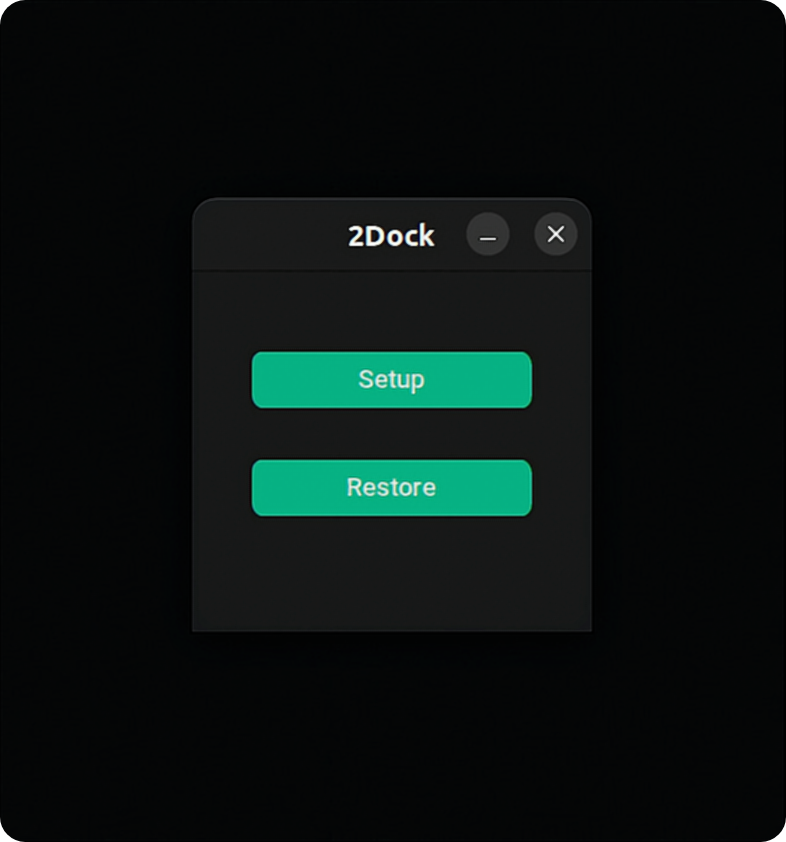
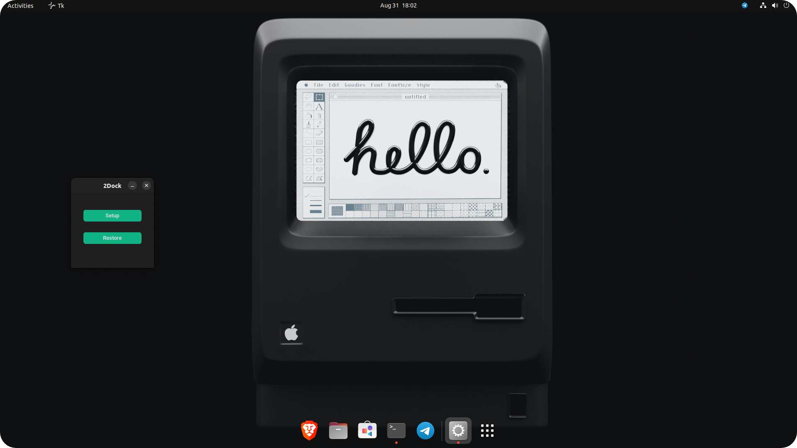

# 2Dock-GUI-App😎
 Its a simple Python based GUI application to modify the ubuntu dash to dock.

&nbsp;

# Download🕊️

- Click here to [Download](https://github.com/dreamcatcher45/)
- Download the zip file
- Extract the zip file
- Right click on app.py
- Click on "Run as program"
- Or open terminal in the current folder 
- Run the app.py file by the following command

```
 ./app.py
```


&nbsp;
# Screenshots 😶‍🌫️

&nbsp;
# Before👽

&nbsp;
# After👻

&nbsp;
 
